# Vulcan
<center>


</center>


[TOC]
> 【+】PS:我想找几个小伙伴一起维护Vulcan的POCScan功能,只要新的CVE出现就写成Pocsuite3格式的插件,加入到漏洞库当中,需要日积月累才能有自己的"军火库",提交Poc的小伙伴可以一起来内测,我想不断完善Vulcan的功能,更好的实现自动化. Email:RedTeamWing#gmail.com

## Background

这应该是我的第一个扫描器,也是为了毕业设计而写的,公开的扫描器没有我想要的,只好自己写了,项目是采用前后端分离开发,要谢谢开发Fuxi的师傅,我跟他要了前端的源码进行学习,临时学了一下Vue,然后借助ANT框架开发UI,上手比较轻松.POCSCAN模块是借鉴Fuxi的方法,XD.

## install
pass
## Usage

```bash
start mongo
start redis
sudo python3 vulcan.py
sudo celery worker -P threads -A celerywing.tasks -B -E  --loglevel=info
```

## Func
- 子域名收集模块
- 主动扫描模块
- 被动扫描模块(crawlergo+xray+dircrack)
- 定时扫描模块
- 钉钉实时告警模块

## UI
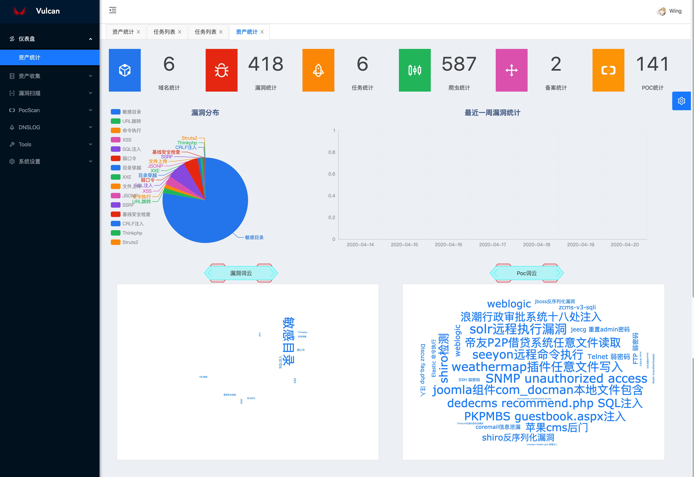

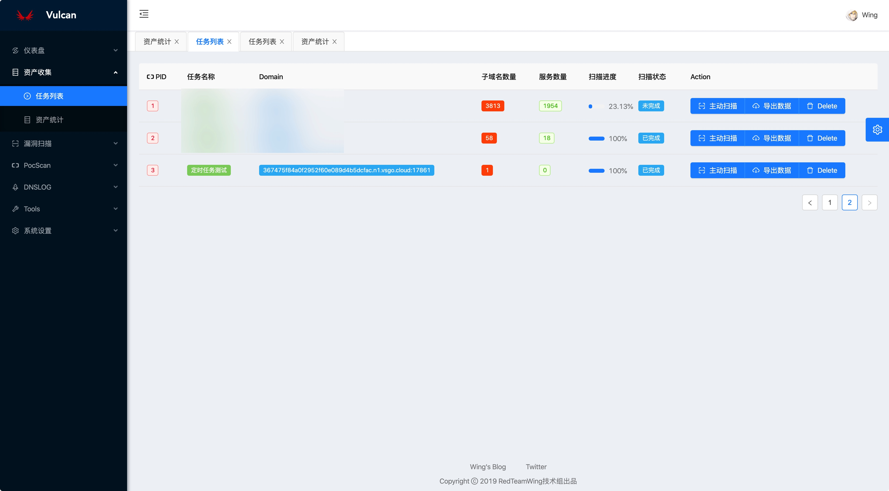

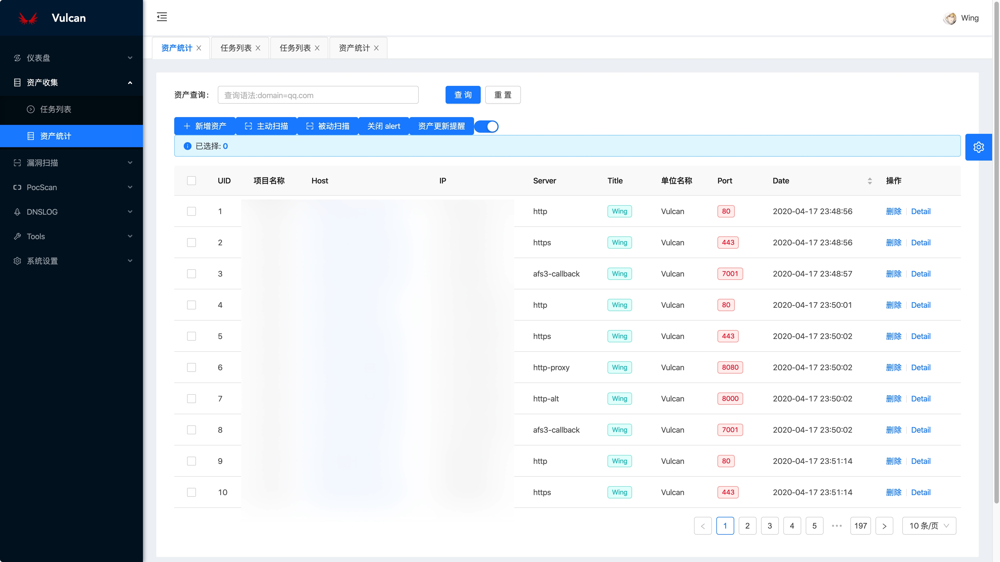

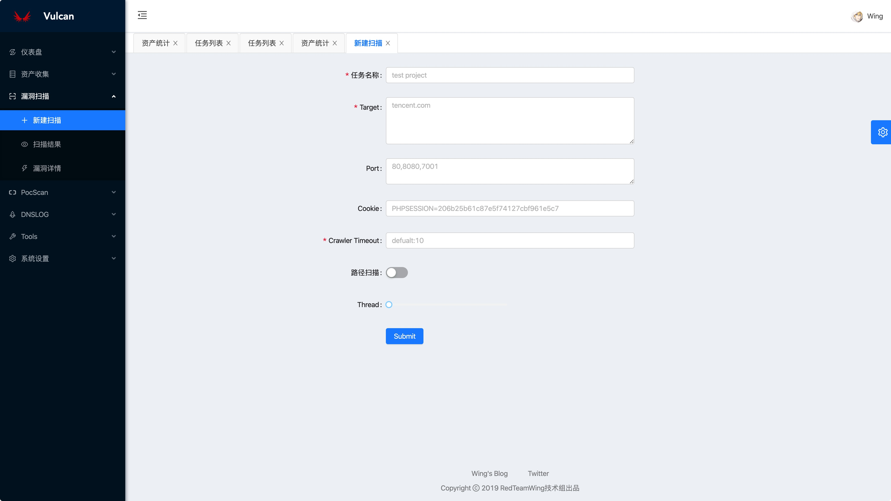

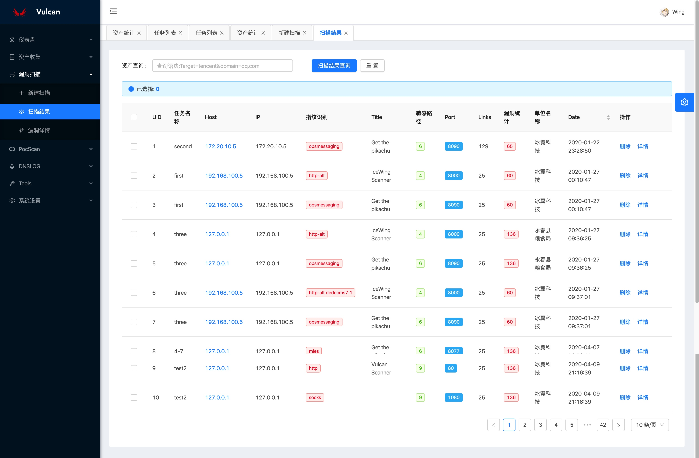


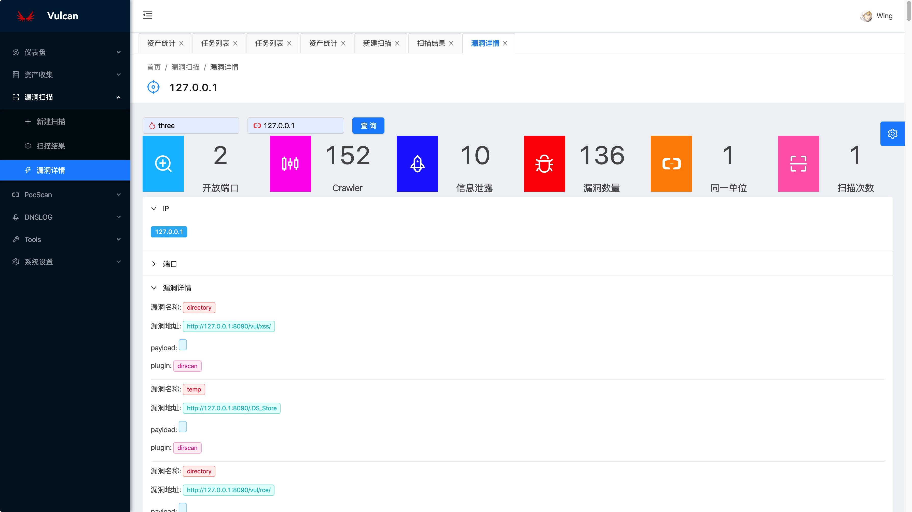

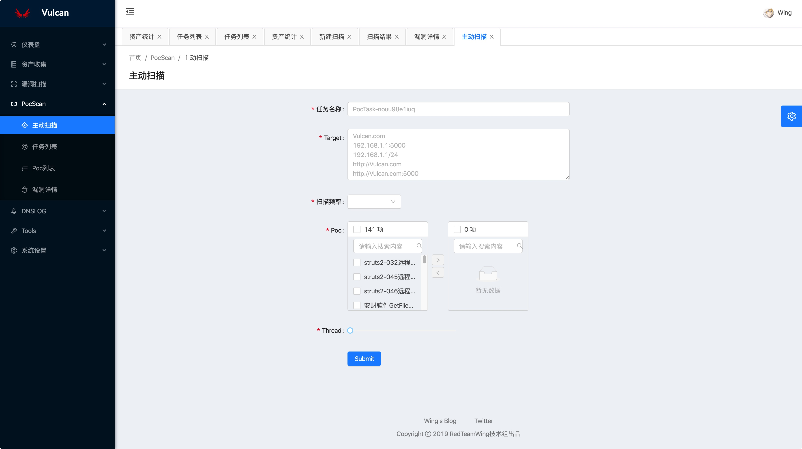

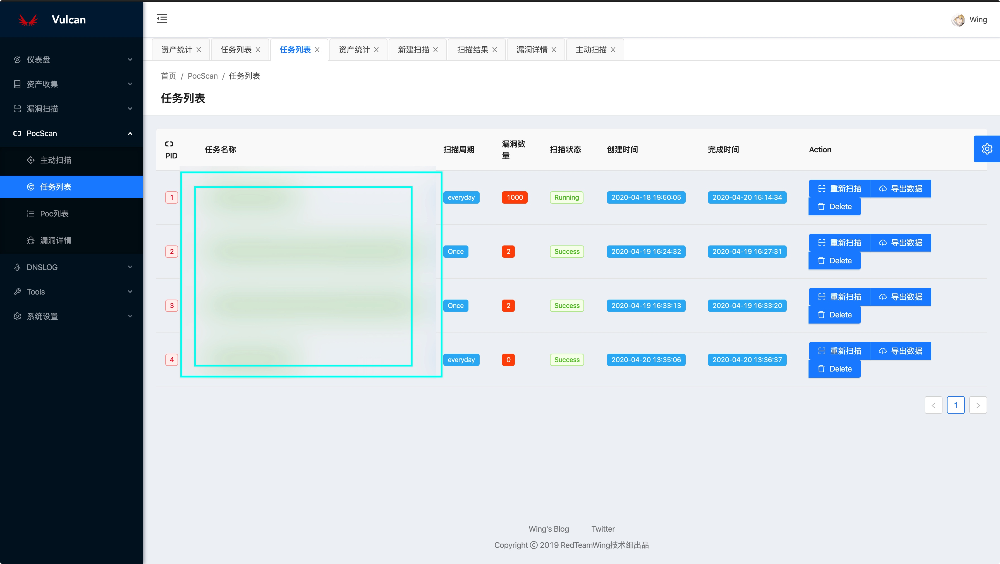

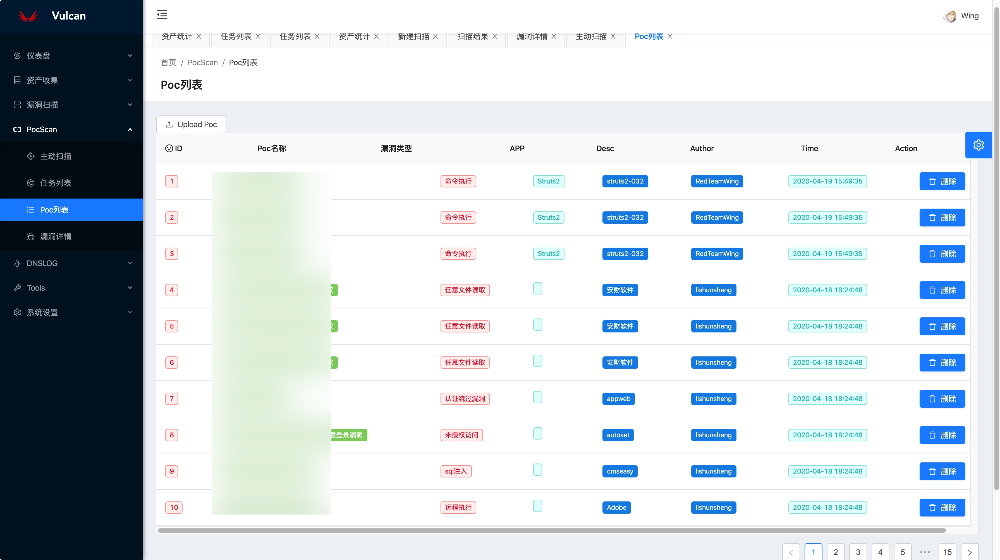

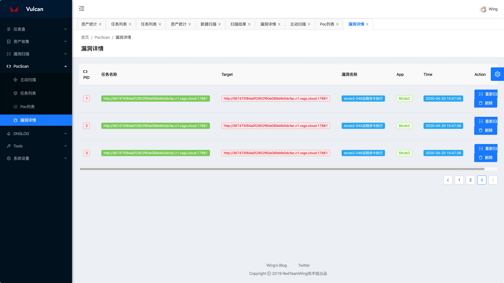

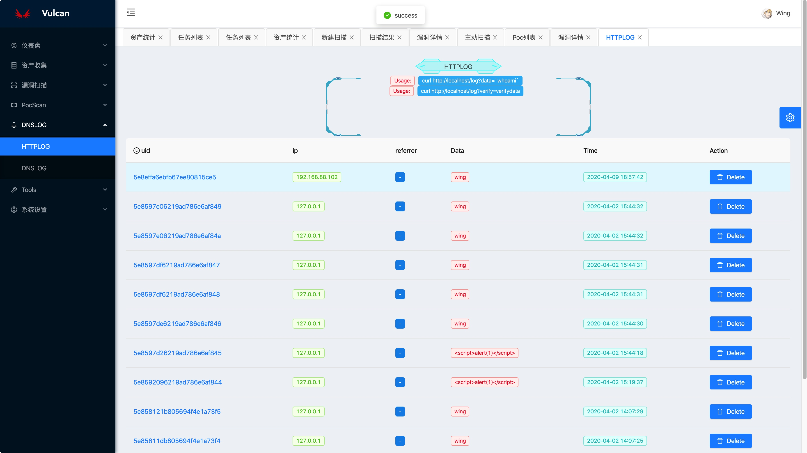

Tools模块是一些在线小工具,文本去重等等(还没写)

测试稳定性之后再考虑开源.
